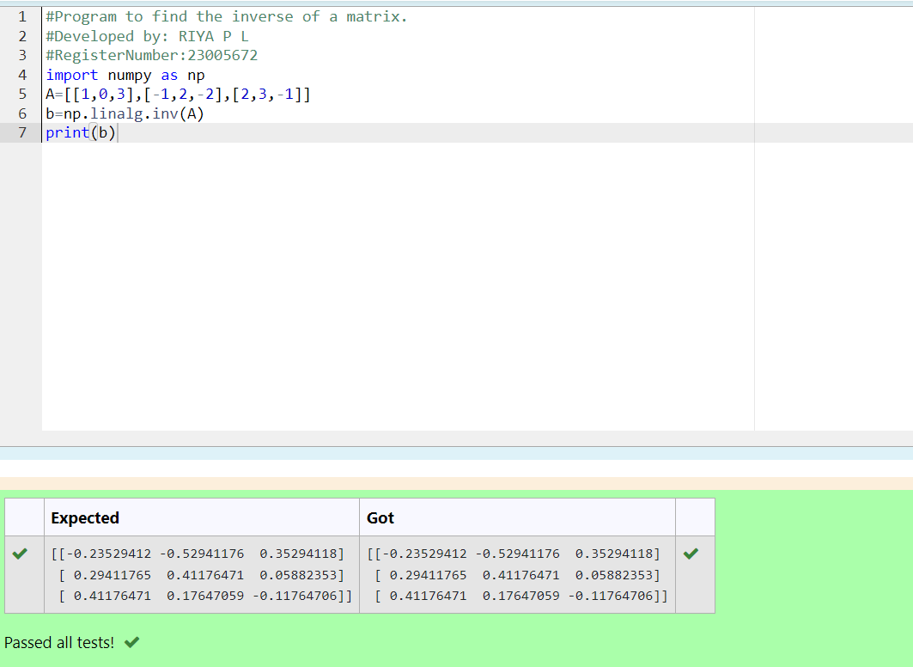

# INVERSE-OF-A-MATRIX
## Aim:
To write a python program to find the inverse of a matrix
## Equipment’s required:
1. 	Hardware – PCs
2. 	Anaconda – Python 3.7 Installation / Moodle-Code Runner
## Algorithm:
### Step1 : 
"import numpy as np' to include NumPy for numerical operations.
### Step 2: 
Create a 3x3 matrix A with specified elements [[1,0,3],[-1,2,-2],[2,3,-1]].
### Step 3: 
Use 'np.linalg.inv(A)' to compute the inverse matrix, assigned to variable b.
### Step 4: 
Display the inverse matrix b using 'print(b)' for examination.

## Program:
```PYTHON
#Program to find the inverse of a matrix.
#Developed by: RIYA P L
#RegisterNumber:23005672
import numpy as np
A=[[1,0,3],[-1,2,-2],[2,3,-1]]
b=np.linalg.inv(A)
print(b)
```
## Output:

## Result:
Thus the inverse of given matrix is successfully solved using python program

